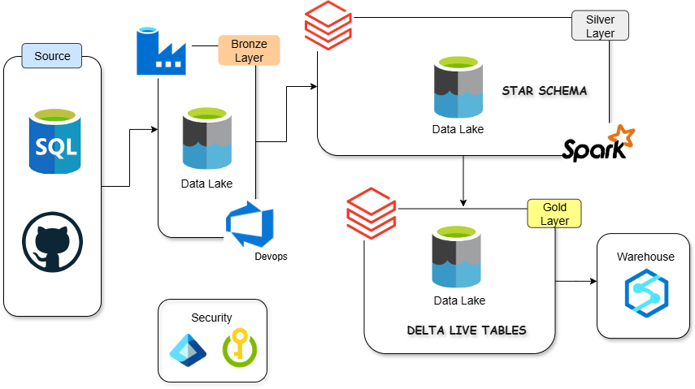

# Spotify End-to-End Data Engineering Project

## 📖 Project Overview
This project demonstrates a production-grade **End-to-End Data Engineering pipeline** built on **Azure** and **Databricks**. 

Unlike traditional static pipelines, this solution focuses on **scalability** and **automation**. It utilizes a **Metadata-Driven Architecture** in Azure Data Factory (ADF) to handle multiple tables dynamically via a single pipeline, and leverages **Databricks Unity Catalog** for modern data governance.

### 🎯 Key Goals
* **Ingest:** Incremental data loading from Azure SQL Database to Azure Data Lake (Bronze Layer).
* **Transform:** Cleanse and aggregate data using Databricks (Silver & Gold Layers).
* **Automate:** Use CI/CD principles with **Databricks Asset Bundles (DABs)**.
* **Govern:** Centralize data access using **Unity Catalog**.
* **Monitor:** Automated email alerting via **Azure Logic Apps**.

## 🏗️ Architecture



**Data Flow:**
1.  **Source:** Transactional data residing in **Azure SQL Database**.
2.  **Ingestion (ADF):**  Reads a configuration file (`loop_input.json`) from GitHub.
    * Iterates through tables using a `ForEach` loop.
    * Checks the "High Watermark" (Last CDC timestamp) stored in ADLS.
    * Ingests only new/modified data to **ADLS Gen2 (Bronze Layer)** in Parquet format.
3.  **Transformation (Databricks):**
    * **Silver Layer:** Cleanses data using **Autoloader** and reusable Python classes (deduplication, schema validation).
    * **Gold Layer:** Aggregates data using **Delta Live Tables (DLT)** with quality expectations (`expect_all_or_drop`).
4.  **Governance:** Access managed via **Unity Catalog** (Centralized Metastore).

## 🛠️ Tech Stack

| Category | Technologies Used |
| :--- | :--- |
| **Cloud Provider** | Microsoft Azure |
| **Orchestration** | Azure Data Factory (ADF) |
| **Storage** | Azure Data Lake Storage Gen2 (ADLS) |
| **Compute & Processing** | Azure Databricks (PySpark, Spark SQL) |
| **Format** | Delta Lake, Parquet, JSON |
| **DevOps & CI/CD** | Databricks Asset Bundles (DABs), Git |
| **Monitoring** | Azure Logic Apps |


## 🚀 Key Features

### 1. Metadata-Driven Ingestion
Instead of creating 20 pipelines for 20 tables, I built **one generic pipeline**.
* **Dynamic Config:** ADF fetches `loop_input.json` from this repo via HTTP Linked Service.
* **Parameterization:** Table names, schemas, and CDC columns are passed dynamically at runtime.

### 2. Robust Incremental Loading (CDC)
* **State Management:** Stores the last successful run timestamp in `cdc.json`.
* **Logic:** `SELECT * FROM source WHERE updated_at > last_run_date`.
* **Optimization:** Includes an `If Condition` to prevent writing empty files if no new data exists.

### 3. Modern Databricks Governance
* **Unity Catalog:** Replaced legacy mounting with modern Unity Catalog External Locations.
* **Access Connector:** Utilized Azure Managed Identity for secure, keyless access to storage.

### 4. Developer Experience (DevOps)
* **Databricks Asset Bundles (DABs):** Used generic code management.
    ```bash
    databricks bundle deploy --target dev
    ```
* **Logic App Alerting:** Webhook trigger catches pipeline failures and sends formatted email alerts containing the Pipeline Name and Run ID.

## 📂 Project Structure

```bash
├── dataset/                    # Azure Data Factory JSON templates
├── factory                     # ID's
├── files/                      # Required python files for transformation and building data pipelines 
├── linkedService/              # Linkded services JSON templates
├── loop_input.json             # Folder, column and cdc parameter in JSON
├── spotify_initial_load.sql    # Intial data file in sql
├── spotify_incremental_load.sql # Incremental sql file
